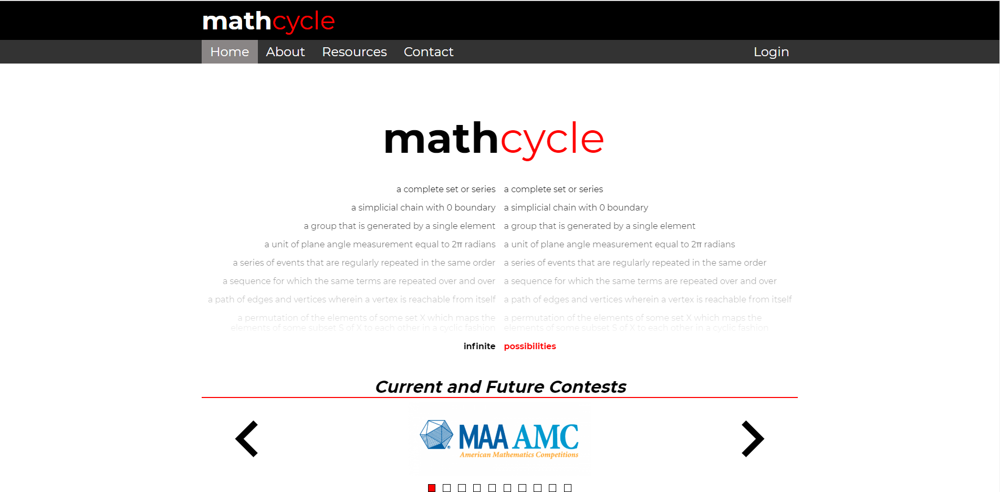
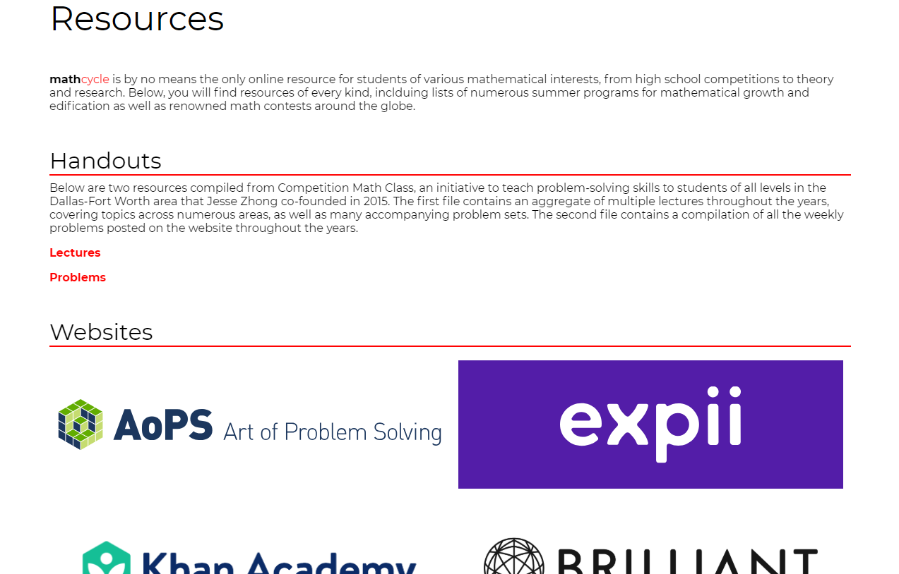
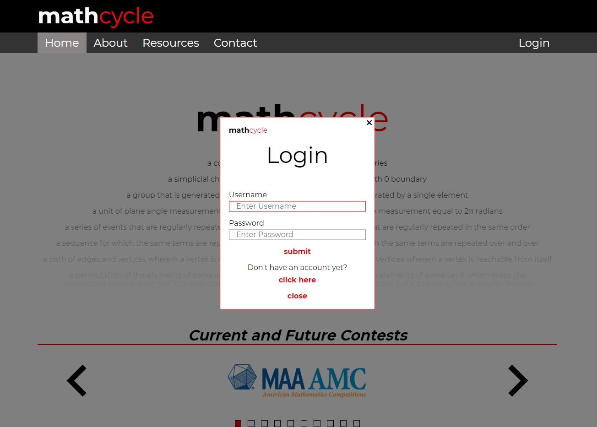
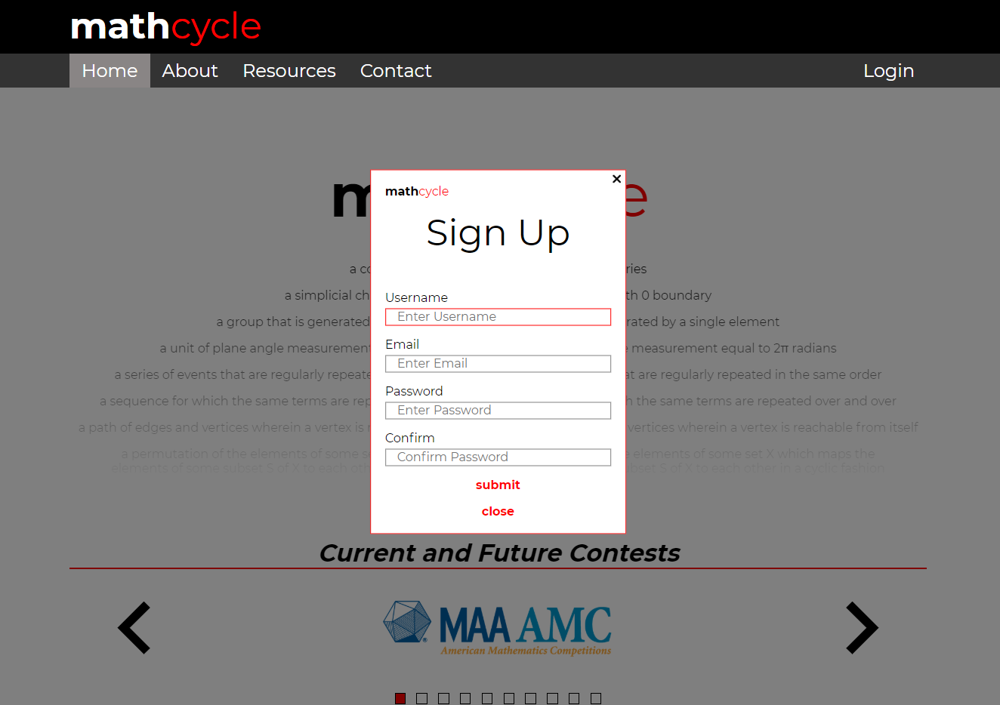
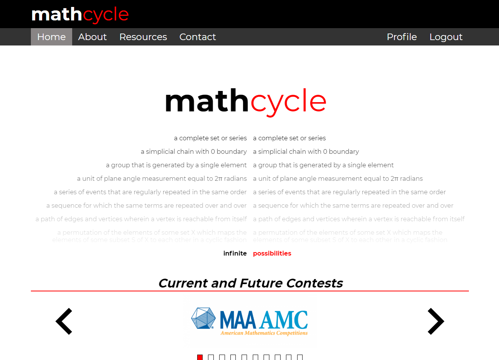

# mathcycle
Built with HTML, CSS, JavaScript, PHP, and SQL; run locally with XAMPP.

**SITE IS NOW LIVE AT MATHCYCLE.CO**

This project is currently in progress. Please see https://mathcycle.co to see up-to-date site.

**Currently Working On:** bugfixing, improving UI, tutorial

## Updates as of 3/19/19
* Profile displays total score as well as subject scores
* Reformatted practice page for aesthetics
* Congratulations page is live for section completion
* **SITE IS NOW LIVE, SEE ABOVE**
* LaTeX math equations implemented
* Font for math equations normalized
* Review section implemented!
* Answers are now hidden on review load

## Bugfixes as of 3/4/19
* Correct/incorrect message not resetting
* Scrollbar images (+ all images) highlight upon spam-clicking
* User practice status not updating
* Scrollbar arrow click radius size is too large
* Score not updating after completion of question
* Login system not working on mathcycle.co
* Trailing directory slash on /profile/

## Bugs/Design Choices (To Be Fixed)
* User status not updated unless **next** is pressed after submitting a correct answer
* Currently unable to access previously solved problems
* Spam click of Math Evolved section not scripted
* Expanding names of Review/Practice shifting other items down

## Problem Pool
* Targetting around 50 problems per subject in ascending difficulty
* Including original problems and selected ones from previous contests

## Compatibility
Chrome desktop compatibility is live; I am working on Firefox, IE, Safari, etc. Mobile compatibility not optimizied.

## Author
Jesse Zhong

## Tutorial
Welcome to the tutorial! We will walk through the major features of the website in the following paragraphs.

### Home Page

At the top, there is a fading list of various definitions of cycles throughout mathematics. Next, there is an interactive sliding component that scrolls through current contests that, upon being clicked on, link to their web pages. 

Next, there are three main parallax sections:
* The first, titled Math Evolved, contains three sections with large titles that make their respective descriptions appear to the right upon clicking.

* The second, titled The Core, describes the four main topic areas of mathematics. When each down arrow is clicked, the description reveals itself in a downwards motion.

* The third contains a list of many popular contests throughout the current contest year, with their colors corresponding to whether they are completed, currently happening, or in the future.

### Resources Page
The resources page contains an array of varioius online resources with accompanying links, as well as two handouts/PDFs of original content that I authored along with other math team members in high school.

### Login Steps
When you click the login button from any of the pages on the site, a login page will fade in: 

Then, either enter your credentials, or click through to the sign up page, where a new page will fade in:

Upon signing up successfully, you will be redirected to the home page. And when you login, you will have access to the member-only resources at mathcycle. The profile tab and logout button will now appear at the top of the nav bar:

